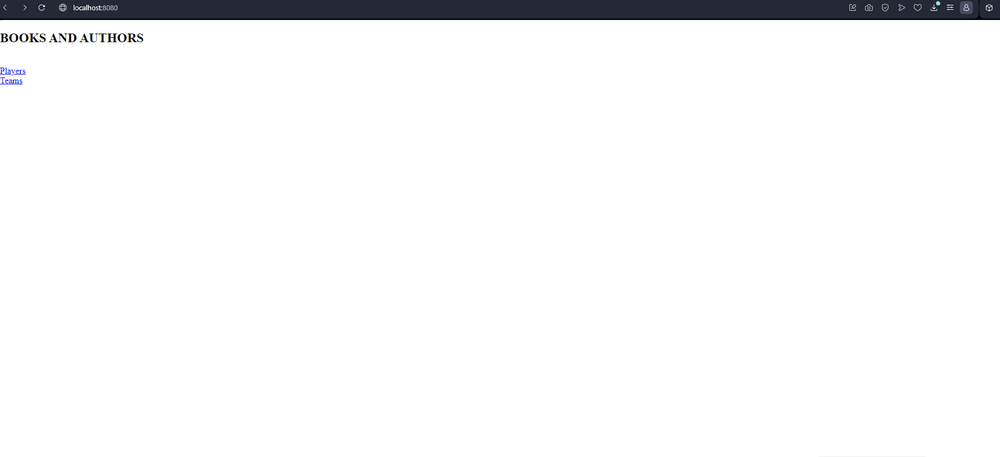

# Практическая работа #2  Приложение Spring
Выполняли студенты группы 6132: ***Иванов Владислав*** и ***Каспаров Иоанн***  

## Задание 1 ##
Модель используем такую же как и в первой лабораторной работе.

## Задание 2 ##
В качестве СУБД используется PostgreSQL.

## Задание 3 ##

_Выберите любую предметную область и создайте модель как минимум из двух объектов с несколькими свойствами.
Создайте скрипт для создания базы данных для вашей модели._

Наша база данных состоит из двух сущностей: студент и факультет
Мы создали модель из двух сущностей: **book** и **author**.

В данном случае реализована связь **Один-ко-многим (One-to-Many)**, автор может иметь несколько написанных книг, а книга имеет единственного автора.

## Задание 4 ##

@Controller для обозначения контроллера;
@Autowired для предоставления экземпляра сервиса.
@GetMapping для получения данных из сервера
@PostMapping для отправки форм

## Задание 5 ##

запустить проект по ссылке http://localhost:8080/

 

 

Для реализации бизнес-уровня использовался метод getAll(), который возвращает список всех книг из базы данных. Внутри метода реализована логика выполнения SQL-запроса и маппинга результатов в объекты book.

