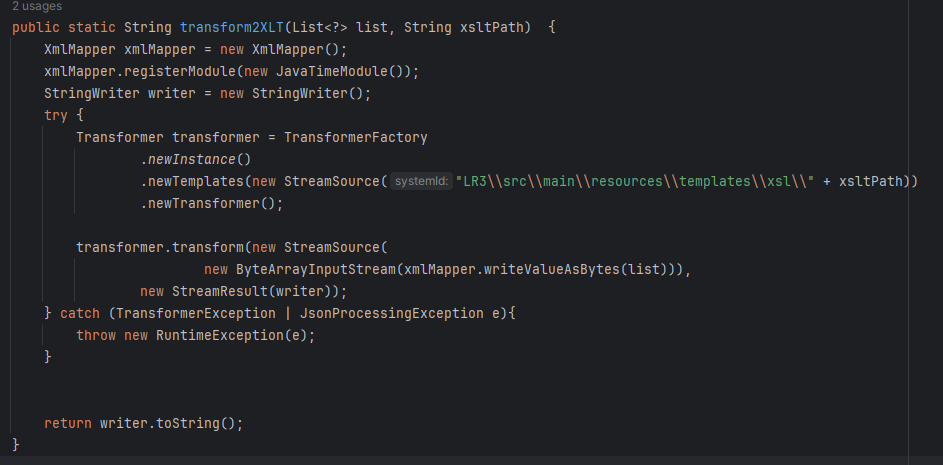
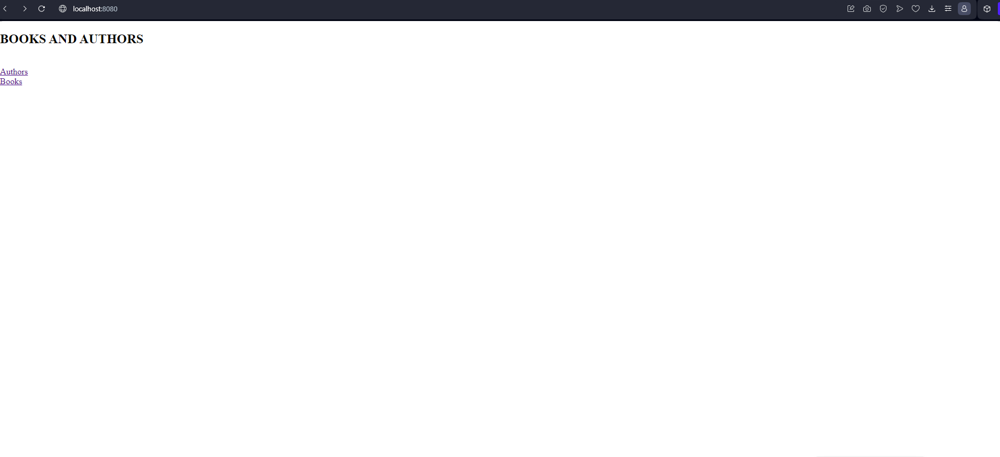

# Практическая работа #3  Приложение REST
Выполняли студенты группы 6132: ***Иванов Владислав*** и ***Каспаров Иоанн***  

## Задание 1 ##
JAX-RS является спецификацией Java EE для создания RESTful-сервисов.

Spring охватывает широкий спектр функциональностей за пределами RESTful-сервисов, такие как, функции вроде внедрения зависимостей, Spring AOP и более широкого набора интеграций (например, Spring Data, Spring Security).

В ходе работы выбор пал на SpringREST, т.к для разработки за основу было взято приложение ЛР 2, основанное на Spring с изменённой конфигурацией и реализован REST API для модели из прошлой работы.

## Задание 2 ##
В качестве СУБД используется PostgreSQL.

## Задание 3 ##

 Authors.xslt

 Books.xslt

AuthorRequest.java

AuthorRequest.java

## Задание 4 ##

 

 

 

